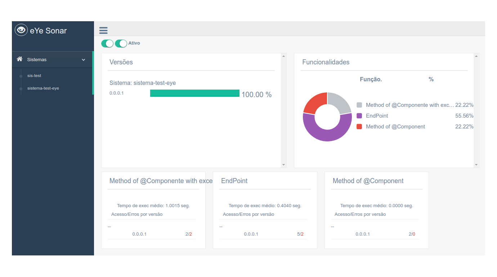

# eYe: Monitoring and Software Metrics

eYe is a simple application that enables the realtime monitoring of Spring Boot software.

## How important is monitoring software?

The relevance of a software monitoring is to identify strategic points of most used functionalities, identify bottlenecks and anticipate possible errors, thus adding value to the product.

## Requirements
    1) Redis
    2) the system that will be integrated must be development in Spring Boot

## Structure
    - eye-monitor: Server developed in Spring boot with the dashboard in Angularjs. This server receives and organizes all metrics;
    - eye: Integration library where it should be added as a dependency in the software where you want to collect the metrics;

## Communication

- [GitHub](https://github.com/marcelosv/eye)
- [Linkedin](https://www.linkedin.com/in/marcelo-souza-vieira-112174a9)
- [Twitter](https://twitter.com/uaicelo)


## What does it do?

#### 1) Monitoring

Monitors a system and collects important metrics.

#### 2) Realtime

With eYe can be seen in real time the metrics of access quantity, exceptions, averages of execution, etc ...

#### 3) Integrating with your software

The integration is very simple, and metrics can be collected from any method using the annotation that eYe defines.

#### 1) Binaries

Add this dependency in your software.

```xml
<dependency>
    <groupId>br.com.eye</groupId>
    <artifactId>eye</artifactId>
    <version>2016.11.1.1-SNAPSHOT</version>
</dependency>
```

#### 2) Configuration
In the application.properties add the keys below. The main one is "eye.url" which should be where the eYe server will be.

```
spring.application.name=nome-sistema
spring.application.version=0.0.0.1
eye.url=http://localhost:8181
```

#### 3) Annotations

```java
    @Sensor(description="Name", tags="test", type=TypesData.API_ENDPOINT)
    @RequestMapping("/exemple")
    public void testar() {
        System.out.println("Hello...");
    }
```
The @Sensor annotation is the primary one and should be used in every method you want to monitor.
Can be monitored endpoints, service, repositorys, etc ...

## Test

#### 1) [Redis](https://redis.io/topics/quickstart).
Start Redis. The server uses redis to record and organize the metrics.

#### 2) Run eYe server.
```
cd eye/target
java -jar eye-monitor-*SnapshotName-Generated*.jar
```

#### 3) Run eYe-test server (optional).

```
cd eye-test/target
java -jar eye-test-*SnapshotName-Generated*.jar
```

#### 4) Go to the link to open the dashboard.
```
http://localhost:8181/
```

- To generate any register on the test server, type:

```
curl http://localhost:8081/test
```


#### 5) Start your system

Start your system and run it normally.
The system will start recording the metrics on the server.



