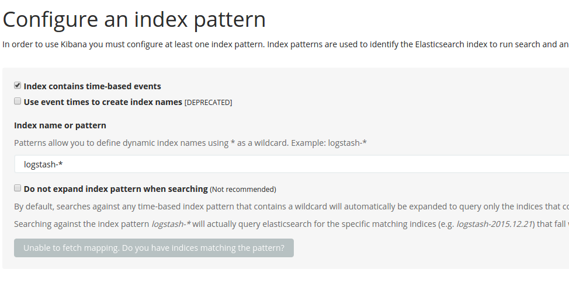

# New eYe: Monitoring and Software Metrics with integration Elasticsearch and Kibana

eYe is a simple application that enables the realtime monitoring of Spring Boot software.

## Version

2017.2.1.1

## Whats is a change the last version?
The first version of eYe had a visual monitor.
We integrated software with eYe and it sent the metrics to the monitor.
Now, one last version, the monitor is finished.
eYe now integrates with Elasticsearch and Kibana.

## How important is monitoring software?

The relevance of a software monitoring is to identify strategic points of most used functionalities, identify bottlenecks and anticipate possible errors, thus adding value to the product.

## Requirements

    the system that will be integrated must be development in Spring Boot

## Structure
    - eye: Integration library where it should be added as a dependency in the software where you want to collect the metrics;

## Run Elasticsearch and Kibana

Change "@IP@" for your IP.

```xml
elasticsearch:
    image: elasticsearch:latest
    ports:
      - "9200:9200"
      - "9300:9300"
    volumes:
      - elasticsearch1:/usr/share/elasticsearch/data

 logstash:
    image: logstash:latest
    command: logstash -e 'input { tcp { port => 5000 } } output { elasticsearch { hosts => "@IP@" } }'
    ports:
      - "5000:5000"

 kibana:
    image: kibana
    ports:
      - "5601:5601"
    environment:
      - ELASTICSEARCH_URL=http://@IP@:9200
```

docker-compose up

## Integrating with your software

#### 1) Binaries

Add this dependency in your software.

```xml
<dependency>
    <groupId>br.com.eye</groupId>
    <artifactId>eye</artifactId>
    <version>2017.2.1.1</version>
</dependency>
```

#### 2) Configuration
In the application.properties add the keys below. 
The main one is "eye.url" which should be where the Elasticsearch server will be.

```
spring.application.name=nome-sistema
spring.application.version=0.0.0.1
eye.url=http://localhost:9200
```

#### 3) Started eYe interceptor
Add annotation

``` java
@ImportAutoConfiguration(value={EyeConfig.class})
```

#### 4) Annotations

```java
    @Sensor(description="Name", tags="test", type=TypesData.API_ENDPOINT)
    @RequestMapping("/exemple")
    public void testar() {
        System.out.println("Hello...");
    }
```

The @Sensor annotation is the primary one and should be used in every method you want to monitor.
Can be monitored endpoints, service, repositorys, etc ...

#### 5) Kibana

First we need to add index the Kibana. The eYe send information with "spring.application.name" + YYYY-MM-DD.
In our exemple, we add o index "nome-sistema*"
Now folder use the index to make the queries.



## Communication

- [GitHub](https://github.com/marcelosv/eye)
- [Linkedin](https://www.linkedin.com/in/marcelo-souza-vieira-112174a9)
- [Twitter](https://twitter.com/uaicelo)


